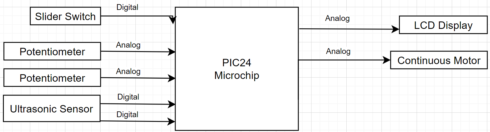
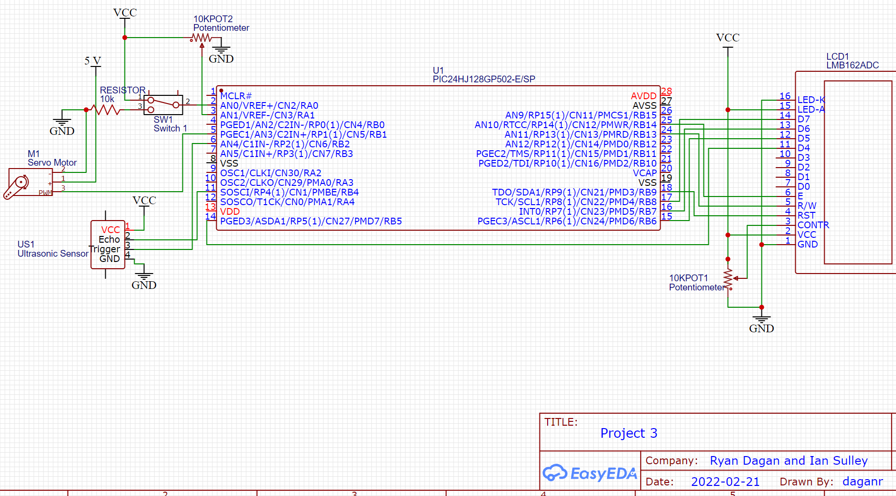
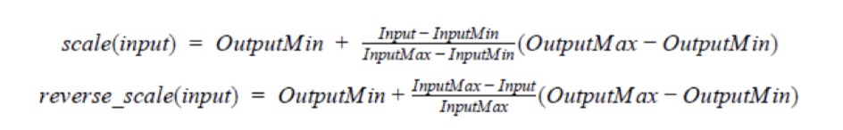

# Project 3: Adaptive Cruise Control

### ECE-218 EMBEDDED MICRO-CONTROLLER PROJECTS

Ian Sulley and Ryan Dagan

Due: 02/21/2022

---

---

# Objectives

The goal of this project is to design, and implement an adaptive cruise control system that is capable of controlling the speed of a car relative to the speed of the car (or object) ahead of it. A continuous servo models the car speed, and an ultrasonic sensor measures the distance between the two cars. A potentiometer will set the desired speed of the motor for a following distance of 15 cm, a lower voltage set on the potentiometer results in a lower speed of rotation for the continuous servo motor and a higher voltage results in a higher speed of rotation. An LCD display will model the car dashboard with a potentiometer being used for the contrast of the screen, the potentiometer will need to be adjusted to get a clear display on the LCD screen. To help with debugging, a slider switch is added that will model when cruise control is activated and de-activated, the built in LED to the microchip will turn on when cruise control is activated and off when cruise control is de-activated.

---

# Design

As mentioned above, the hardware of our system includes a continuous servo motor and LCD display which will be controlled by the software, and the ultrasonic sensor, two potentiometers, and a slider switch which will be controlled and set by user input. The PIC24 microchip interacts with all the hardware through the pins they are connected to as well as the 3.3 volts the microchip supplies to each hardware component excluding the continuous servo motor. The continuous servo motor is powered by a 5 volt battery pack, which differs from the 3.3 volt supply from the microchip, because 3.3 volts is not enough to operate the continuous servo motor and 5 volts is to high of a voltage to apply to the PIC24. As previously mentioned the PIC24 microchip is used to implement the software that controls the continuous servo motor and LCD display based on the user inputs from the two potentiometers, ultrasonic sensor, and slider switch. The software for the system is used to convert the voltage read from the potentiometer to a discrete value that corresponds to the continuous motor pulse width based on analog and digital signals from the user input hardware. 

### Hardware Components

The inputs of the system are the two potentiometers, the slider switch, and the ultrasonic sensor. Both of these hardware components are connected to the 3.3 Volts power rail and ground from the headers of the microchip. The two potentiometers send analog signals to the microchip to be used for the contrast of the LCD display screen and to set the desired speed of the continuous servo motor for a distance of 15 cm. The distance is measured by the ultrasonic sensor that sends two digital bits to the microchip, one for the echo and one for the trigger. The slider switch sends a digital bit to the microchip for if cruise control is de-activated or activated. The outputs of the system are the LCD display and the continuous servo motor. The LCD display is also connected to the 3.3 Volts power rail and ground from the microchip and is used to model the dashboard of a car by giving the values of speed and distance. The continuous servo motor is powered by the battery pack and receives an analog signal from the microchip which changes its speed based on the distance from the input of the ultrasonic sensor. The block diagram in Figure 1 below shows the digital and analog connections with the microchip for the inputs and outputs.



                        Figure 1: Block Diagram for Adaptive Cruise Control System #NOTE: LCD IS DIGITAL

As seen from the block diagram, for the user input hardware, the ultrasonic sensor and slider switch send digital bits and the two potentiometers send analog signals. The outputs, the continuous servo motor and the LCD display receive analog signals from the microchip to change the speed of the continuous servo motor or the contrast of the LCD display. The pin assignments for the hardware components and schematic can be seen below in Figure 2.



                        Figure 2: Circuit Schematic for Adaptive Cruise Control System

As seen in Figure 2, the continuous servo motor is attached to output pin 5 and the battery pack. The potentiometer that controls the servo motor is connected to input pin 3, the potentiometer to control the contrast of the display screen is connected to pin 3 of the LCD display screen, and the slider switch to activate or deactivate the cruise control system is connected to input pin 2 of the microchip. The last input is the ultrasonic sensor, which is connected to pin 6 for the trigger and pin 11 for the echo. The display screen is connected to pins 14, 15, 16, 17, 18, 24, and 25. As mentioned previously, the analog signal of the potentiometer is important in the project because this provides the voltage value that is converted to represent pulse minimum and pulse maximum. The digital signal from the slider switch is used by the software to tell the circuit if cruise control is activated or deactivated. The analog signal for the continuous servo motor is sent to the motor by the microchip to instruct it on the speed to operate at. Also seen in the schematic of Figure 2, the PIC24 power and ground are connected to all hardware components aside from the continuous servo motor.

### Peripherals

The servo motor control system required the use of many of the **PIC24HJ128GP502** peripherals, including timers, interrupts, output compare, input compare, and ADC. All of these aside from the ADC were needed for pulse width modulation motor control. The ADC was required to read the analog value from the potentiometer that was converted to a discrete value corresponding to the continuous motor pulse width. 

 

---

## Software

The following sections outline the main components of the C code that controls the pulse width modulation for the continuous servo motor control signal, as well as the ultrasonic sensor input control.

### Libraries

This project uses both the **`pic24_all`** and **`lcd4bit_lib`** libraries to control the hardware components of the project. 

```c
#include "pic24_all.h"
#include "lcd4bit_lib.h"
```

`**lcd4bit_lib**` provides the functions `configControlLCD(void)`, `initLCD(void)`, `writeLCD(int, int, int, int)`, and `outStringLCD(char*[])` which provide the necessary functionality to  configure and write to the LCD display. Likewise, **`pic24_all`** provides the functionality required for the C program to interface with the **PIC24HJ128GP502**. 

### Setup / Initialization

 The `#define` compiler directive was used to set the pin assignments for the potentiometer, trigger, and cruise toggle hardware, as well as to define constants useful for motor control.

```c
// #defines constant macros
#define POT (_RA1)
#define TRIG (_LATB2) 
#define TOGGLE_CRUISE (_RA0)

#define PWM_PERIOD 3125
#define P_CONT_MIN 203
#define P_CONT_MAX 265
```

Five global variables are used. The first two are `echo_rise` and `echo_fall` which are true and false flags that keep track of which edge of the echo pulse is occurring. The next two, `rise_time` and `fall_time` hold the rising and falling edge timer values that are captured by the IC1 peripheral. The last global variable, `pwm_Cont` is used to hold the pulse width values for the continuous servo motor.

```c
volatile uint8_t echo_rise; 
volatile uint8_t echo_fall; 
volatile uint16_t rise_time; 
volatile uint16_t fall_time;
uint16_t pwm_Cont;
```

### Global Functions

Many of the functions are merely wrappers for configuring various peripherals and I/O. `configIO()` configures the pins for the potentiometer and continuous servo motor. `configOC1()` configures the output compare module to control the pulse width for the continuous servo motor, while `configTimer2()` also configures the required timer. The interrupt service routine on timer 2 updates the output compare registers with the new value of `pwm_Cont` every time the interrupt flag is raised. `configSensor()` configure the pins for the trigger and echo of the ultrasonic sensor. `configIC1()` configures the input compare module to capture the input from the echo of the ultrasonic sensor, while `configTimer3()` configures the required timer. The interrupt service routine on timer 3 updates the input compare registers with the new values of `echo_rise`, `echo_fall`, `rise_time`, and `fall_time`.

```c
float scale(float reading, uint16_t min, uint16_t max);
void configIO(void);
void configOC1(void);
void   _ISR   _T2Interrupt(void);
void configTimer2(void);
void configTimer3(void);
void configIC1(void);
void configSensor(void);
void   _ISR   _IC1Interrupt(void);
char *numToASCII(uint8_t num);
float calcDistance(float echo_duration);
uint8_t limitSpeed(uint8_t maxSpeed, uint8_t distance);
void displayDashboard(uint8_t speed, uint8_t distance);
```

The `scale()` function allows for ADC input reading of the potentiometer to be converted to an appropriate pulse width value within the operating range of the two servo motors being controlled. 

```c
float scale(float reading, uint16_t min, uint16_t max){
    float readRatio = ( (float) reading *  3.3) / 1023;
    uint16_t ServoDiff = max - min; // calculates difference in servo
    float readRatio_ServoDiff = readRatio * ServoDiff;
    return readRatio_ServoDiff + min;
}
```

`limitSpeed()` limits the speed of the motor based on the distance calculated by the `calcDistance()` function. `numToASCII()` converts a number to ASCII to be displayed on the display screen with the `displayDashboard()` function, this would be values for speed and distance. 

### Main Loop

The behavior of the adaptive cruise control system was modeled by three variables and a single switch single-case statement. The three variables that constantly update are for distance of the object in front of the ultrasonic sensor, maximum speed, and current speed of the continuous servo motor. For the single switch single-case statement, the variable TOGGLE_CRUISE is the state of the continuous servo motor. case 0 corresponds with when cruise control is de-activated, and case 1 corresponds with when cruise control is activated. When cruise control is de-activated the continuous servo motor uses the desired speed, which is received as a voltage by the potentiometer and converted into a discrete value used by the pulse width module, to maintain the motor at a constant speed. When cruise control is activated, the continuous servo motor limits the desired speed based on the distance of the object detected in front of the ultrasonic sensor, if the distance is greater than 15 cm then the motor should increase rotation speed and if the distance is less then 15 cm, then the motor should decrease rotation speed.

## Serial Output

```c
/* Main program loop */
// printf serial printing commented out for compilation efficency
```

The first section of the main while loop operates the ultrasonic sensor pulse. Originally this set of instructions was in a separate function called `pulseUltrasonic()`. However, this caused issues with the IC1 Interrupt properly executing and so was removed. 

```c
	/* collect & compute inputs*/
	// printf("----Main While-------\n\r");
	//	echo_pulse = pulseUltrasonic();
```

```c
// printf("Echo pulse time: %f \n\r", echo_duration);
// printf("Distance %f \n\r", distance);
// printf("Max Speed:  %d\n\r", maxSpeed);
// printf("Cruise Speed: %d\n\r", cruiseSpeed);
// printf("PWM signal: %d \n\r", pwmCont);
// printf("---- End Main While-------\n\r");
// printf("\e[1;1H\e[2J");//Write a null-terminated string to the serial port.
//printf("----SWITCH-----\n\r");

```

```c
// printf("CC Inactive\n\r");
// printf("PWM signal: %d \n\r", pwmCont);
// printf("Distance: %f \n\r", distance);
// printf("\e[1;1H\e[2J");//Write a null-terminated string to the serial port.

 // printf("CC Active\n\r");
 // printf("PWM signal: %d \n\r", pwmCont);
 // printf("Distance: %f \n\r", distance);
 // printf("\e[1;1H\e[2J");//Write a null-terminated string to the serial port.
```

```c
while (1) {
  TRIG = 1;
	DELAY_US(10);
	TRIG = 0;
	echo_rise = 1;
	while(!echo_fall){
	}
	float echo_duration = fall_time - rise_time; //in Tcks
	echo_duration = echo_duration *1.6; //in us
        distance = calcDistance(echo_duration);
	echo_fall = 0;
	DELAY_US(50);
```

`**maxSpeed**` used `scale2()` to convert the ADC value to the motor speed. `**cruiseSpeed`** holds the speed adjusted for adaptive cruise control functionality. 

```c
	maxSpeed = scale2(convertADC1(), ADC_MIN, ADC_MAX, 234, P_CONT_MAX);
	cruiseSpeed = limitSpeed(maxSpeed, distance);
```

The  switch statment takes the digital input from the hardware switch and controls whether or not the cruise control functionality is active. The dashboard is also updated differently to correspond with the different speeds. 

```c
	switch(TOGGLE_CRUISE){
			/* CRUISE CONTROL DE-ACTIVATED*/
        	case 0:
                pwmCont = maxSpeed;
               
		displayDashboard(maxSpeed, distance);
                break;
                
            /*CRUISE CONTROL ACTIVATED*/
            case 1:
                pwmCont = cruiseSpeed; 
								 displayDashboard(cruiseSpeed, distance);
								 break;
	    }
	}
	return 0;
}
```

---

# Results and Discussion

### Observed Behavior

The system was fully operational for all expected behavior. It successfully registered the desired speed set by the **`POT`** potentiometer and responded to obstacles placed at varying distances from the ultrasonic sensor. When an obstacle was within 15 centimeters of the ultrasonic sensor, the continuous motor came to a complete stop; from 15-25cm the motor speed adapted automatically using the `scale2()` function between 0 and the maxSpeed; and beyond 25cm it went at the maximum speed. This system also successlly implemented the additional feature of a toggle switch, which allowed for the adaptive cruise control system to be turned on or off, indicated by a green LED. Testing with an obstacle and a yardstick confirmed our expected meaurements from the ultrasonic sensor. In addition, the LCD display output the distance from the closest obstacle and the speed of the motor. 

### Code Size (Memory Use)

| Total Data | Percentage (%) | 8,192 (0x2000) Total bytes |
| --- | --- | --- |
| Data Used | 4% | 358 bytes |
| Data Free | 96% | 7,834 bytes |

| Total Program | Percentage (%) | 43,776 (0xAB00) Total Words |
| --- | --- | --- |
| Program Used | 18% | 8,078 words |
| Program Free | 82% | 35,698 |

### Debugging

`printf()` from the **`stdio.h`** library provided very useful debugging information and allowed us to follow the execution of the program and accommodate the use of interrupts. The debugger in MPLabs X IDE was also useful at some points for testing other functions of the code such as the scale function and ADC. The Ultrasonic sensor proved to be challenging to work with and debug and we were unable to have it properly execute in a function outside of the main while loop. Ultimately, leaving the ultrasonic pulse in the main loop was functional and did not impact performance.

---

## Conclusion

In conclusion, this project helped better our understanding of how embedded microcontroller systems function and gave us more experience using MPLab. The trigger sensor was the most important part of this project, the value received from it had to be made readable by the pulse width module in order to get any main part of our system to function, without it there would be no way to limit or control speed of the continuous servo motor. The potentiometers were second in importance, the continuous servo motor and LCD display rely on the potentiometers to read the LCD display and set the desired cruise control of the motor, without the potentiometers, there is no value to be converted to control the speed of the continuous servo motor and the contrast of the LCD display can not be adjusted to make it readable if it is not.

### Challenges

the primary challenge of this project was managing the increasing complexity that came with using many of the **PIC24HJ128GP502** pins, as well as peripherals. The hardware requirements necessitated organized circuits in order to speed up debugging and reduce the likelihood of breaking hardware. Additionally, the code controlling the micro-controller had to remain organized in order to ensure the various peripherals were functioning desirably. The pulse width sent to the motor relied on the output compare peripheral, which relied on the interrupt, which relied on the timer. If any of these peripherals were configured incorrectly, the system would either not work, or worse, potentially damage the servo and/or **PIC24HJ128GP502** hardware.

---

### APPENDIX A: Code

```c
/* 
 * File: main_Proj3.c
 * Author: Ian Sulley
 * Date:  02/21/22
 * Purpose: Automatic Cruise Control
 * Modified:
 */
/*********** COMPILER DIRECTIVES *********/

// #include for textbook library header files
#include "pic24_all.h"
#include "lcd4bit_lib.h"
//#include "stdio.h"

// #defines for handy constant macros (uppercase by convention)
#define POT (_RA1)     // Control Motor Speed
#define TRIG (_LATB2)  // Trigger Output
#define TOGGLE_CRUISE (_RA0)  // Toggle Cruise Control

#define PWM_PERIOD 3125
#define P_CONT_MIN 203
#define P_CONT_MAX 265

#define ADC_MIN 0
#define ADC_MAX 1023

/*********** GLOBAL VARIABLE AND FUNCTION DEFINITIONS *******/
volatile uint8_t echo_rise; 
volatile uint8_t echo_fall; //True/False flags to keep track of which edge of the echo pulse has occurred. 
//The echo_fall will also communicate from the ISR to the main program that the pulse is complete.

//hold the rising and falling edge timer values captured by the IC1 peripheral
volatile uint16_t rise_time; 
volatile uint16_t fall_time;
    
uint16_t pwmCont; // PWM for continuous servo 

char str[3];

void configTimer2(void){
    
    T2CONbits.TON = 0;  // Turn off Timer 2 
    T2CONbits.TCKPS = 0b11; //prescale 1:256 
    PR2 = PWM_PERIOD;
    TMR2 = 0; // init timer to 0
    _T2IF = 0; // init flag to 0
    T2CONbits.TON = 1;  // Turn on Timer 2
}

void   _ISR   _T2Interrupt(void){
    OC1RS = pwmCont;       //OC2RS register assigned pwm for continuous
    _T2IF = 0;
}

/*Standard Servo*/
void configOC1(void){
    T2CONbits.TON = 0;  // Turn off Timer 2
    CONFIG_OC1_TO_RP(RB1_RP); //Map OC1 to pin RP1 (pin 5)
    
    //Use Timer2 as clock for OC1
    OC1RS = 0; // Clear
    OC1R = 0; // Clear
    
    OC1CONbits.OCTSEL = 0; // output compare module to use Timer 2 as the clock source
    OC1CONbits.OCM = 0b110; // operate in PWM mode with fault pin disabled
}
    
void configIO(void){
    CONFIG_RA1_AS_ANALOG();//MOTOR CONTRL POTENTIOMETER
    CONFIG_RA0_AS_DIG_INPUT(); // Cruise Control Switch
} 

//USE TIMER 3 for IC
void configTimer3(){
    
    T3CONbits.TON = 0;  // Turn off Timer 3 
    T3CONbits.TCKPS = 0b10; //prescale 1:64
    PR3 = 0xFFFF; //maximum value
    TMR3 = 0; // init timer to 0
    _T3IF = 0; // init flag to 0
    T3CONbits.TON = 1;  // Turn on Timer 3
}

void configIC1(void){
	T3CONbits.TON=0; //Turn off timer 3
	CONFIG_IC1_TO_RP(RB4_RP);//attach input capture to RB4 (pin 11)
	IC1CONbits.ICTMR = 0; // Uses timer 3
	IC1CONbits.ICI= 0b00;
	IC1CONbits.ICM= 0b001;
}

/*function will set the pin direction and digital mode for both the Trig(output) function will set the pin direction and digital mode for both the Trig(output)
 * and echo(input) signals.
 */
void configSensor(void){
	CONFIG_RB2_AS_DIG_OUTPUT();
	CONFIG_RB4_AS_DIG_INPUT();
	TRIG = 0;
}

void   _ISR   _IC1Interrupt(void){
	uint16_t T_edge; //Variable to hold edge time
	T_edge = IC1BUF; //get timer value of edge from IC1 Buffer
	_IC1IF = 0;//clear interrupt flag

	switch(echo_rise){
		
		case 1:
			rise_time = T_edge;
			echo_rise = 0;
			break;

		case 0:
			fall_time = T_edge;
			echo_fall = 1;
			break;
	}
}

/* Return  num in ASCII format 000*/
char *numToASCII(uint8_t num){
    	uint16_t Nint = num;
	str[0] =0x30;str[1] = 0x30; str[2] = 0x30; //formated ASCII
    
	while(Nint > 100){
        	Nint = Nint -100;
        	str[0]++;
    	}
    	while(Nint > 10){
        	Nint = Nint - 10;
        	str[1]++;
    	}
	while(Nint > 0){
		Nint = Nint - 1;
		str[2]++;
	}
	return str;
}

uint16_t scale2(uint16_t x, uint16_t x_min, uint16_t x_max, uint16_t y_min, uint16_t  y_max){
	
    uint16_t output_range = y_max - y_min;
	uint16_t input_range = x_max - x_min;
	
	uint16_t y;
	y = (x - x_min) * (float) output_range / input_range + y_min;
	return y;
}

float calcDistance(float echo_duration){
	//Distance in centimeters = echo_duration(us)/58
	return echo_duration / 58;
}

uint16_t limitSpeed(uint16_t maxSpeed, float distance){
	if(15 < distance && distance < 25){ //return a scaled speed to relative to the distance from the car ahead 
		return scale2(distance, 15, 25, 234, maxSpeed); //**TODO** confirm scale function works  
	}
	else if(distance < 15){ //if car ahead is getting too close,STOP
		return 0;
	}
	else return maxSpeed;
}

void displayDashboard(uint8_t speed, uint8_t distance){
	writeLCD(0x80, 0, 0, 1); //Write command to position cursor at 0x40
	outStringLCD("Speed:          ");
	writeLCD(0x8A, 0, 0, 1); //Write command to position cursor at 0x40
	numToASCII(speed);
	outStringLCD(str);
	writeLCD(0xC0, 0, 0, 1); //Write command to position cursor at 0x40
	outStringLCD("Distance: ");
	writeLCD(0xCA, 0, 0, 1); //Write command to position cursor at 0x40
    numToASCII(distance);
	outStringLCD(str);
}

float pulseUltrasonic(void){
	TRIG = 1;
	DELAY_US(10);
	TRIG = 0;
	echo_rise = 1;
	while(!echo_fall){
	}
	float echo_duration = fall_time - rise_time; //in Tcks
	echo_duration = echo_duration *1.6; //in us
	echo_fall = 0;
	DELAY_US(50);
	return echo_duration;
}

/********** MAIN PROGRAM ********************************/
int main ( void ){
	/* Declare local variables */
	uint16_t maxSpeed;
	uint16_t cruiseSpeed;
	float echo_pulse;
	float distance;

	/* Call configuration routines */
	configClock();  //Sets the clock to 40MHz using FRC and PLL
	configTimer2();
	configTimer3();
	configIO();
	configOC1();
	configIC1();
	configControlLCD(); //configures the RS, RW and E control lines as outputs and initializes them low
	initLCD(); // initialization LCD: clears the screen and sets the cursor position to upper left (home)
	configSensor();
	configADC1_ManualCH0(RA1_AN, 31, 0);        // configures ADC 
	configUART1(230400);

	/* Initialize ports and other one-time code */
	outStringLCD("Initializing");
	//printf("\e[1;1H\e[2J");//Write a null-terminated string to the serial port. 
	//printf("Initializing...\n\r");
    
	pwmCont = 234; // setting pwm to midway for cont servo
	
	_T2IF = 0;
	_T2IE = 1;
	T2CONbits.TON = 1;
	
	TRIG = 0;
	echo_rise = 1;
	echo_fall = 0;
	_IC1IE = 1;
	T3CONbits.TON = 1;
	DELAY_MS(500);

	/* Main program loop */
	while (1) {
        
		/* collect & compute inputs*/
     //   printf("----Main While-------\n\r");
	//	echo_pulse = pulseUltrasonic();
	
	TRIG = 1;
	DELAY_US(10);
	TRIG = 0;
	echo_rise = 1;
	while(!echo_fall){
	}
	float echo_duration = fall_time - rise_time; //in Tcks
	echo_duration = echo_duration *1.6; //in us
        distance = calcDistance(echo_duration);
	echo_fall = 0;
	DELAY_US(50);
	maxSpeed = scale2(convertADC1(), ADC_MIN, ADC_MAX, 234, P_CONT_MAX);
	cruiseSpeed = limitSpeed(maxSpeed, distance);
        
	//printf("Echo pulse time: %f \n\r", echo_duration);
        //printf("Distance %f \n\r", distance);
        //printf("Max Speed:  %d\n\r", maxSpeed);
        //printf("Cruise Speed: %d\n\r", cruiseSpeed);
        //printf("PWM signal: %d \n\r", pwmCont);
        //printf("---- End Main While-------\n\r");
        //printf("\e[1;1H\e[2J");//Write a null-terminated string to the serial port.

        //printf("----SWITCH-----\n\r");

		switch(TOGGLE_CRUISE){
			/* CRUISE CONTROL DE-ACTIVATED*/
        	case 0:
                pwmCont = maxSpeed;
                //printf("CC Inactive\n\r");
                //printf("PWM signal: %d \n\r", pwmCont);
                //printf("Distance: %f \n\r", distance);
                //printf("\e[1;1H\e[2J");//Write a null-terminated string to the serial port.
                
		displayDashboard(maxSpeed, distance);
                break;
                
            /*CRUISE CONTROL ACTIVATED*/
            case 1:
                //printf("CC Active\n\r");
                //printf("PWM signal: %d \n\r", pwmCont);
                //printf("Distance: %f \n\r", distance);
                //printf("\e[1;1H\e[2J");//Write a null-terminated string to the serial port.
                pwmCont = cruiseSpeed;
                
		displayDashboard(cruiseSpeed, distance);
		break;
	    }
	}
	return 0;
}
```

### APPENDIX B: Scale Function

