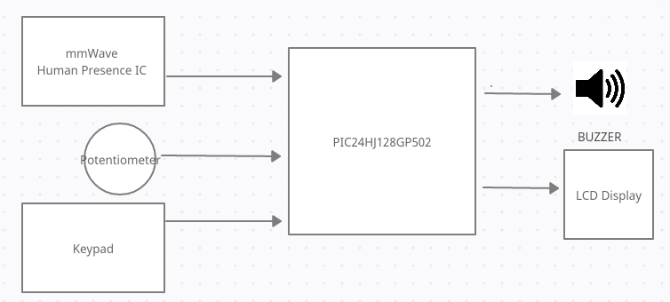
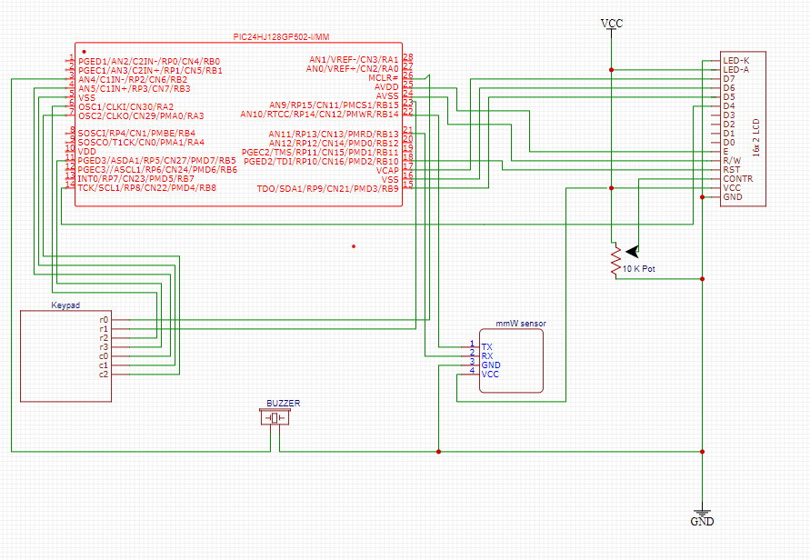
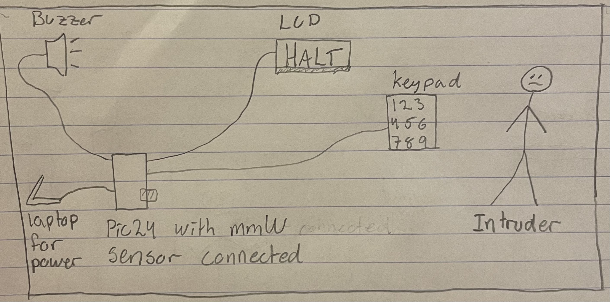
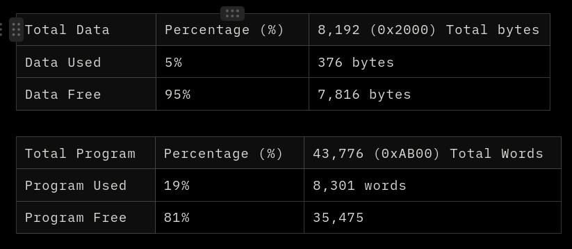

# ECE-218 Project 4 - Milestone 4

# Industrial Security System

Ian Sulley & Gabriel Seger

03/11/2022

# Objectives

### Project Definition

Industrial security systems are an important tool for keeping people, and assets protected from danger and damage. Additionally, industrial security systems can provide useful monitoring data for understanding what is occurring at a given time and place. Unfortunately, the benefits of security systems are often offset by the cost of collecting vast amounts of personal data on individuals it may surveil. Our project aims to provide an anonymous, yet highly accurate, industrial security system for intrusion detection within a range of 9 square meters, whether it be humans or animals. 

### Project Solution

By using a mmWave human detection device, an intrusion will be accurately identified within 9 square meters, without being de-anonymized. The system will output a warning chime using a buzzer and display “HALT” to indicate an intrusion has been detected. A manual authorized deactivation/ override functionality will be implemented by a keypad. This system is ideal for settings with heavy machinery, or high levels of hazardous material, where detecting a human or animal presence in a dangerous area is critical, but capturing personally identifiable information (such as an image) is not necessary.

### Project Decomposition

The following sub-functions were identified in order to complete the project. In the table below the alternatives are demonstrated. 

1. Detect human presence in a room 
2. System output a warning signal to an intruder
3. Possibility to override system without de-anonymizing the intruder
4. System output a warning message through the display to the intruder
5. Reset system if the intruder leaves the room and there is no human presence in the room

| Sub-functions | Alternative A | Alternative B | Alternative C |
| --- | --- | --- | --- |
| 1. Detect human presence | Detect motion using radio waves | Detect motion using ultrasonic sensor | Detect alarm clock using sound sensor |
| 2. Alarm person | Using a buzzer | Using a LED |  |
| 3. Possibility to override system | Using RFID/NFC tag | Using a keypad | Using fingerprints |
| 4. Display a warning sign on a screen | Display message on LCD display | Display message on PUTTY |  |
| 5. Detect no human presence | Detect motion using radio waves | Detect motion using ultrasonic sensor | Detect alarm clock using sound sensor |

Optimal design: 1A, 2A, 3B, 4A, 5A

# Final Design

### Hardware overview

The components needed for the project were: a PIC24 microcontroller chip, a 10k Ohm Potentiometer, a radar sensor, a keypad, a buzzer, an LCD display, and a 6V battery pack. The box diagram in figure 1, below, shows how the microcontroller and each of the components communicate with each other. Note that the keypad, potentiometer, and radar sensor are inputs to the system while the buzzer and LCD display are outputs. 



*Figure 1: Hardware block diagram of a system*

Everything is centered around the PIC24, and its input and output pins along with its onboard peripherals allow it to read from, write to, and power the components. First off, it’s important to note that the mmW sensor is powered by a 6-volt battery pack while the other components are powered by the PIC24 and therefore provide 3.3 volts. Except for power and ground, the sensor was only connected to pin 21 in order to send either a high or a low signal depending on the presence in the room. The keypad had three pins that is used as inputs, pins 4, 5, and 7. The other 4 are configured as outputs in order to check which column the signal comes from. The buzzer is simple and works as an output, it’s connected to pin 3 and ground. Lastly, we have the LCD display that has four bits of parallel data (D7-D4) and three control (Reset, Read/Write, Enable) that were connected to seven I/O pins of the PIC-24 – 14, 15,16, 17, 18, 24, 25. It was used to demonstrate a warning message to the intruder. A potentiometer is connected between the LCD and power with the purpose of controlling the brightness of the LCD. 



*Figure 2: Hardware schematic of the system*

**Project Sketch**



Figure 3*: Illustrate the construction and location of parts*


Figure 4*: Illustrates actions if an intruder enters the room*

# Software Overview

The following sections explain how the security system was implemented in software.

### Configuration

The majority of the pin configuration was handled by the LCD4bit_lib.c library and the keypad_SM.c provided to us. Some adjustments were required to allow for the use of multiple external actuators.  Pin 21 (RB10) was set as a digital input to receive the reading from the mmWave Radar output pin. Pin 3 was set as a digital output pin to activate our buzzer. The global variable `AUTH` was used to store the current authorization state, determined by whether the correct password was input into the keypad.

```c
#include "pic24_all.h"
#include "lcd4bit_lib.h"
#include "keypad_SM.h"
#include "stdio.h"
#include "string.h"

#define BUZZER (_LATA1) // macro for _LATA1, the port write register bit for RA1 (pin 3).
#define DETECTION (_RB10 == 1) // macro for _LATB10, the port write register bit for RB10 (pin 21).

/*********** GLOBAL VARIABLE AND FUNCTION DEFINITIONS *******/
uint8_t AUTH = 0; // global variable to track authority
```

### Main SM Code

```c

/* This state machine is used to determine what is displayed on the LCD and the output of the buzzer.
 * It begins in the reset state. Then, it moves to the active state where it checks
 * for detection and authorization, if true buzzer goes on and Alarm is displayed.
 * Moves to override if authorized and while turning off buzzer and displays override.
 * Default state sends it back to the reset state.
 */
enum SM1_STATES { SM1_Reset, SM1_Active, SM1_Alarm, SM1_Override} SM1_STATE;

void main_Tickfct(void) { 
    char *line1;
    
   switch(SM1_STATE) { 
      case SM1_Reset:
         if (1) {
            SM1_STATE = SM1_Active;
         }
         break;
      case SM1_Active:
         if (DETECTION & !AUTH) {
            SM1_STATE = SM1_Alarm;
         }
         else if((DETECTION || !DETECTION) && AUTH){
            SM1_STATE = SM1_Override;
         }
         break;
      case SM1_Alarm:
         if (DETECTION && !AUTH) {
            SM1_STATE = SM1_Alarm;
         }
         else if (DETECTION && AUTH) {
            SM1_STATE = SM1_Override;
         }
         else if (!DETECTION && !AUTH){
            SM1_STATE = SM1_Active;
         }
         break;
      case SM1_Override:
         if (!AUTH) {
            SM1_STATE = SM1_Active;
         }
         else if (AUTH) {
            SM1_STATE = SM1_Override;
         }
         else {
            SM1_STATE = SM1_Override;
         }
         break;
      default:
         SM1_STATE = SM1_Reset;
         break;
   }
   switch(SM1_STATE) { 
      case SM1_Reset:
         break;
      case SM1_Active:
          BUZZER = 0;
          line1="  Active  ";
          printLCD(line1);         
         break;
      case SM1_Alarm:
          BUZZER = 1;
          line1="Alarm!";
          printLCD(line1); 
          break;
      case SM1_Override:
          BUZZER = 0;
		 line1="Override";
         printLCD(line1);
         break;
   }
}

```

In addition to this state machine, we are also concurrently using the `keypad_sm.c` to take user input and raise and lower the `AUTH` flag as needed.

## Keypad_SM.c

the keypad state machine handles the keypad input and validation of the password for raising the `AUTH` flag. Each time a key is pressed it is written to the `input_password` char array. Then, when the # key is entered, `input_password` is compared to `PASSWORD`. If they match  `AUTH` is set to 1 and the Override state is entered. If `AUTH` is 0 the Override state is exited.

```c

uint8_t keypad_auth = 0; // variable to track if authorized or not
char *PASSWORD = "1001#"; // password that's needed for authorization

volatile uint8_t t2flag = 0;  //timer flag to synchronize state machine
char input_password[5];    /**password character array used to store user input*/

/* This state machine functions the keypad. It is used to check the which 
 * key is pressed.
 */
enum SM_states {S_C0, S_C1, S_C2, P, WR} state;
void SM_fct(void) {
/* Inputs: KP()
*  Outputs: C0, C1, C2
*  Variables: col, row - col needs to be static because 
*  it is used as a transition condition*/
    uint8_t rw; // local row  
    static uint8_t col;  //static column variable - default initialization is 0 on first call
	switch (state) { //transitions
	    case S_C0:
	      if (KP()) {
			  state = P;
			  col = 0;  //Mealy output action
		  } else  {
			  state = S_C1;
		  } break;
		case S_C1:
		   if (KP()) {
			  state = P;
			  col = 1;  //Mealy output action
		  } else  {
			  state = S_C2;
		  } break;
		case S_C2:
		   if (KP()) {
			  state = P;
			  col = 2;  //Mealy output action
		  } else  {
			  state = S_C0;
		  } break;
		case P:
		  state = WR;
		  break;
		case WR:
		  if (KP()) {state = WR; }
		  if (!KP() && (col == 0)) { state = S_C1;}
		  if (!KP() && (col == 1)) { state = S_C2;}
		  if (!KP() && (col == 2)) { state = S_C0;}
		  break;
		  default:
		  state = S_C0;
	}
	switch (state) { //outputs
	    case S_C0:
		   C0=0; C1=1; C2=1;
		break;
		case S_C1:
		   C0=1; C1=0; C2=1;
		break;
		case S_C2:
		   C0=1; C1=1; C2=0;
		break;	 
		case P:
		   rw = get_row();
           strncat(input_password,&keypad_table[rw][col],1);
           writeLCD(0xC4, 0, 0, 1);
           outStringLCD(input_password);
           if(keypad_table[rw][col] == ENTER){
               updateAuth();
           }
		break;
		case WR:
		break;
		default:
		break;
	}
}

/* call the keypad SM and synch it with SM1 */
void keypad_syncSM(void){    
    SM_fct();
    while(!t2flag);
    t2flag = 0;    
}
```

### Raising and Lowering `AUTH` flag

While the `AUTH` flag is only raised and lowered in the  main_Proj4.c, we use updateAuth() and getAuth() functions in keypad_SM.c to allow the keypad information to be accessed from the main function.

```c
void updateAuth(void) {
    writeLCD(0xC0, 0, 0, 1);
    outStringLCD("PW READ: ");
    //password[strlen(password)-1] = '\0'; 
    outStringLCD(input_password);
    
    if (strcmp(input_password, PASSWORD) == 0) {
        keypad_auth = 1;
    } else {
        keypad_auth = 0;
    }
    DELAY_MS(3000);
    reset_pw_capture();
}

/*getter function to declare if authorize is 0 or 1*/
uint8_t getAuth(){
    return keypad_auth;
}
```

### Main Loop (main_Proj4.c)

The program main loop is very simple. It calls the two state machine functions and the `AUTH` update function.

```c
    while(1){  // main while loop that calls the state machines
          main_Tickfct();
          keypad_syncSM();
          AUTH = getAuth();
    }

```

## Debugging

While debugging the project we ran into a few issues managing the vast number of pin configurations when interfacing with numerous external sensor and actuators. However, these issues were easy to fix considering they produced glaring errors and were not issues associated with the logic of our code. Once there pin configuration issues were solved, the remaining aspects of the project fell into place without much difficulty. Having an LCD output to reference for checking the current state and input was very helpful for getting the additional features of the project fully functional.

# Results and Discussion

### Observed Behavior

The system was fully operational for all expected behavior. It successfully detected human presence in a room, and successfully read and compared a user password input to override the security system. When a human was near the security system it triggered the alarm output and the audio buzzer. When the person left the room with the sensor, the alarm was successfully deactivated. Additionally, the two concurrent state machines successfully operated in tandem, where state transitions and keypad input were both correctly processed and had the desired results. All subfunctions were also tested separately multiple times. For example, the LCD display was given different types of characters and messages, from different states to make sure it worked properly before connecting it to the rest of the system. Another example is the keypad, in order to verify the password worked properly, different wrong passwords were typed onto the keypad to verify that only the right password would give authorization, this is also shown in the video. The sensor involved a few different tests as well, obviously human detection was tested, but it was also tested in different rooms and with different lighting in order to verify it only reacted to human presence and not other factors. The buzzer included some simple testing as it was given a high signal in a separate program at first, when it behaved accordingly, it was connected to the full system. In Figures 5 and 6, the wiring and connection between parts are demonstrated. 


*Figure 5: Full hardware system with LCD output*


*Figure 6: Zoomed in version of hardware system*

### Code Size (Memory Use)



# Conclusion

In conclusion, this project was a successful implementation of a security system. We successfully interfaced with a new peripheral the 24GHz mmWave Radar chip. Additionally, we successfully implemented a concurrent state machine solution, which accurately communicated variables and inputs across multiple c files. The project also utilized new string functionality using the c string library. The security system successfully differentiated between an unoccupied and occupied room. The system also successfully performed string comparison password validation. The project was an effective demonstration of the application of skills and technologies throughout the course while incorporating new and novel techniques.